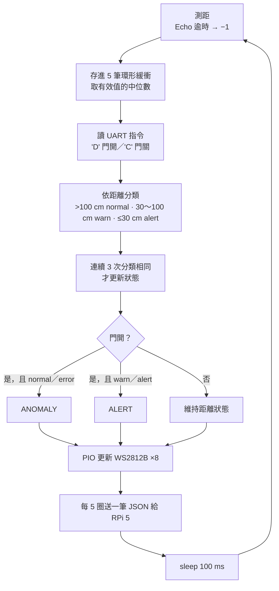

# Seminar_PICOW — 機櫃安全模組的 Pico W 韌體

用 Raspberry Pi Pico W（RP2040）寫的裸機 C 韌體，負責機櫃安全模組裡「有人靠近」的判斷和現場燈號：

- HY-SRF05 超音波測距
- 判斷人離機櫃多近
- 用 PIO 驅動 WS2812B 燈條顯示狀態
- 經 UART 把結果回報給本地 Raspberry Pi 5

| Repo | 內容 |
|---|---|
| **Seminar_PICOW**（本 repo） | Pico W 韌體 |
| [Seminar_RPi5](https://github.com/a9921/Seminar_RPi5) | RPi 5 端的 Python agent 與部署設定，含整個模組的系統架構 |
| [rack-door-kmod](https://github.com/a9921/rack-door-kmod) | 門磁簧開關的 Linux kernel module |

## 狀態與燈號

| `state` | 名稱 | 條件 | 燈號 |
|---|---|---|---|
| `0` | ERROR | 量測失敗（逾時或沒有回波） | 藍 |
| `1` | NORMAL | 距離 > 100 cm | 綠 |
| `2` | WARN | 30 cm < 距離 ≤ 100 cm | 黃 |
| `3` | ALERT | 距離 ≤ 30 cm；或門開且有人在附近 | 紅燈恆亮 |
| `4` | ANOMALY | 門開，但附近沒有人（或量測失敗） | 紅燈閃爍 |

門的狀態不是 Pico 自己量的，而是 RPi 5 經 UART 告訴它的（見下方 UART 協定）。

## 主迴圈



## 設計重點

**WS2812B 交給 PIO**：WS2812B 用高電位時間的長短表示 0／1，一個 bit 約 1.25 µs，容許誤差約 ±150 ns。用 GPIO 軟體切換的話，會被中斷打斷、時序跑掉。改用 RP2040 的 PIO 狀態機產生波形，CPU 只要把 24-bit 顏色值丟進 FIFO。

**兩層濾波**：

1. **中位數**：最近 5 筆量測取中位數，失敗的量測（−1）不列入，單次誤測或漏回波不會影響結果。
2. **狀態去抖動**：分類結果要連續 3 次相同才會切換狀態，距離剛好在門檻附近時，燈號才不會閃來閃去。

**不會卡死**：等待 Echo 的每個階段都設了逾時（量測前確認 Echo 已回到低電位最多等 10 ms，等上升緣、等下降緣各最多 50 ms）。逾時就回傳 −1，主迴圈照常往下跑。

**距離換算**：距離 = Echo 高電位時間 × 0.0343 cm/µs ÷ 2（以 20 °C 左右的音速計算）。

## UART 協定

UART0，115200 8N1。

| 方向 | 格式 | 說明 |
|---|---|---|
| Pico → RPi 5 | `{"dist_mm": 452, "state": 2, "door": 0}\r\n` | 每 5 圈送一筆（每圈至少 100 ms，約 0.5 秒多一點）；量測失敗時 `dist_mm` 為 `-1`；`state` 是套用門狀態後的結果 |
| RPi 5 → Pico | 單一字元 `D`／`C` | `D` 門開、`C` 門關；其他字元忽略；每圈以非阻塞方式讀取 |

上表的數值僅為示意。

USB 序列埠另外輸出除錯訊息（例如 `  45.2 cm    -> WARN (yellow)`），可以用序列埠監看工具觀察。

## 接線（Pico W 端）

| Pico W 腳位 | 接到 |
|---|---|
| GP0（UART0 TX） | RPi 5 UART RX |
| GP1（UART0 RX） | RPi 5 UART TX |
| GND | RPi 5 GND（UART 一定要共地） |
| GP3 | HY-SRF05 Trig |
| GP2 | HY-SRF05 Echo |
| GP15 | WS2812B DIN |

## 可調參數（`ws2812.c` 開頭的 `#define`）

| 參數 | 值 | 說明 |
|---|---|---|
| `NUM_PIXELS` | 8 | 燈珠數量 |
| `BRIGHT` | 40 | 亮度（0～255） |
| `DIST_WARN` | 100.0 cm | 距離 ≤ 這個值進入 WARN |
| `DIST_ALERT` | 30.0 cm | 距離 ≤ 這個值進入 ALERT |
| `SAMPLES` | 5 | 中位數濾波的樣本數 |
| `SAME_STATE` | 3 | 連續幾次相同才切換狀態 |
| `TICK_MS` | 100 ms | 每圈結束時的 sleep 時間 |
| `BLINK_TICKS` | 4 | ANOMALY 閃爍週期（亮 4 圈、暗 4 圈） |
| `PRINT_TICKS` | 5 | 每幾圈回報一次 |

## 建置與燒錄

- 開發環境：Pico C SDK 2.3.0、Arm GNU Toolchain 15.2.Rel1（arm-none-eabi-gcc 15.2.1），`PICO_BOARD=pico_w`
- **VS Code**：用 Raspberry Pi Pico 擴充套件開啟這個資料夾，直接 Compile。
- **命令列**：設好 `PICO_SDK_PATH` 後，執行下面兩行，產生 `build/pio_ws2812.uf2`。

```sh
cmake -B build
cmake --build build
```

燒錄：按住 BOOTSEL 接上 USB，Pico 會出現成 `RPI-RP2` 隨身碟，把 `.uf2` 拖進去。

## 檔案

| 檔案 | 說明 |
|---|---|
| `ws2812.c` | 主程式。以 Pico SDK 的 ws2812 範例為起點：`put_pixel()`、`urgb_u32()` 與 PIO 初始化沿用範例；測距、中位數濾波、狀態判斷、燈號、UART 協定與主迴圈是我寫的 |
| `ws2812.pio` | Pico SDK 官方範例的 PIO 程式，不是我寫的（BSD-3-Clause） |
| `ws2812_parallel.c` | Pico SDK 官方範例原檔，沒有參與建置 |
| `CMakeLists.txt` | 建置設定，由 VS Code 擴充套件產生後修改（加上 `hardware_uart`） |
| `pico_sdk_import.cmake` | Pico SDK 提供的標準匯入檔 |
